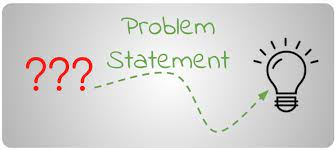
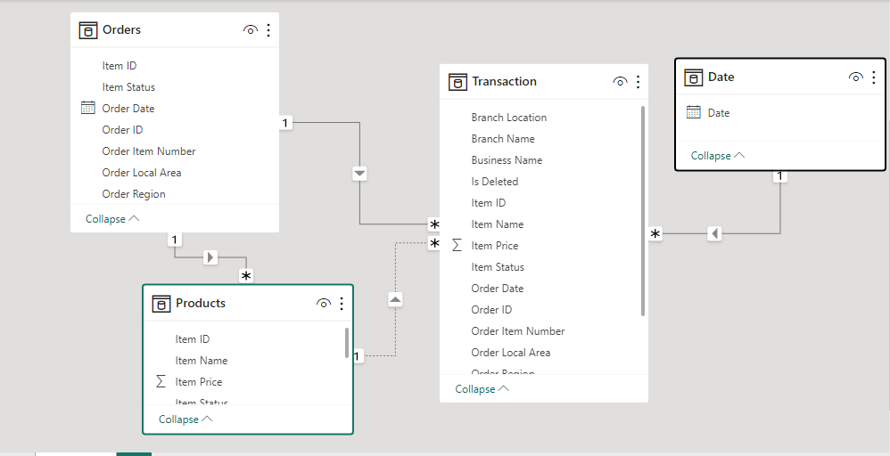
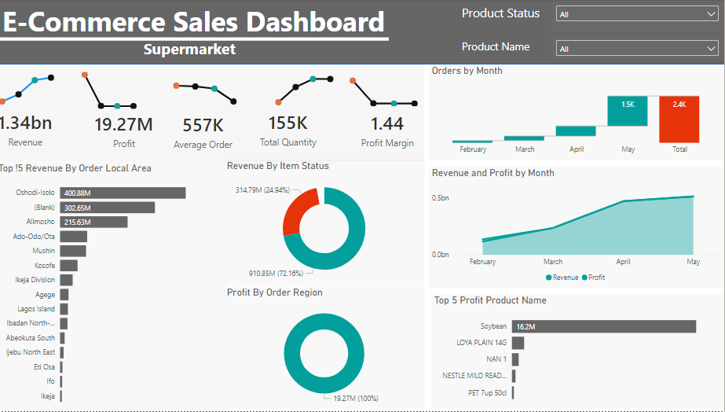

# E-commerce-Sales-Analysis

## Introduction

E-commerce has grown over the years. The lure of ordering goods and services from the comfort of your room has become seamless and flawless. Online malls make millions of money from sales of their products all round the clock. Digital marketing also made millions of people to be reached at onces and more and much more people are reached just with few clicks on our gadgets. 

This analysis looks into the key performances indexes of a Nigerian E-commerce ventures. The E-commerce data are difficult to access, and i dont want to analyse Amazon, Ebay, Alibaba, Walmrt, Macdonald or other big foreign stores. I want Nigeria e-commerce stores and i eventually got one, the name is not given but the products from the data shows that it is a nigerian online mall. This analysis covered the period of February 1st, 2021- May 1st, 2021. A period of three months.

## Problem Statement

The following are the problem statements:

- Total sales, Profit, Average others, Total quantity ordered and the profit margin  within the period.

- The sales declining stimulation.

- low profit margin and profit improvement.

- high cost reduction.

## Skill demonstrated

- Analytical skills.

- Predictive skills.

- Critical thinking.

- Excel.

- Power Bi.

- Data cleaning and transformation.

## Data Sourcing

This data is sourced from www.kaggle.com. This data originally has 16 columns, and 3929 rows. It's an excel file. A clean data with zero errors and null values.

## Data Transformation

This is a clean data. However, i wanted to create other tables; order table and product table from the sales table, so i duplicacted the sales table, renamed them into order table and product table and i renamed the e-commerce table(sales) transaction. Then i created a Date table, using calender function. Therefore i have four tables; Transction, Orders, Products and Date .

## Data Modelling

Having these four tables necessitate data modelling. Relationships was established among the four tables. The star schema was used and the primary table is the transaction table. Duplicate was removed immediately from the orders table and products table to eleminate many to many relationship and its ambiguities. Interestingly as expected, automatically one to many relationships were established between order table and products tables with the transaction table using their primary keys; Order id, Product Id and subsequently, a one to many relationship was established between the date table and the sales table using the date column.

## Analysis And Visualization.

Here  are few discoveries from the analysis; 

- The revenue from sales was 1.34 Billion, the profit was 19.27 Milllion, the total quantity sold was was over 155,000 the profit maerginal was 1.44%.

- The profit margin was too low for such investemt, the revenue was high at that period but the profit of 19.27 Million was low.

- Almost all sales were from Lagos despite, there were extremely low patronage from other southwest states in Nigeria.

- Profit and profit margin were initially higher, later probably due to adverse prevailing economic conditions in the country , the profit and subsequently profit margin fell despite there was juat maerginal descrease in the quantity sold, this could only be due to increase in cost.

## Conclusion And Recommendation

- Conduct a detailed cost analysis to identify areas where costs can be reduced without compromising product quality or customer experience.
Negotiate better deals with suppliers to lower the cost of goods sold (COGS).
Optimize inventory management to reduce carrying costs.

- Reevaluate your pricing strategy. Consider whether you can increase prices without losing a significant number of customers. Implement dynamic pricing if applicable.
Offer bundled packages to increase the average order value.

- Segment your customer base to identify high-value customers who are more profitable.
Implement personalized marketing and product recommendations to increase customer retention and cross-selling.

- Streamline your supply chain to reduce shipping and fulfillment costs.
Explore options like dropshipping or outsourcing to lower operational expenses.

- Invest in data analytics and business intelligence tools to gain deeper insights into customer behavior, sales trends, and cost structures.
Use data to make informed decisions about inventory, marketing, and product offerings.

- Diversify your product range to attract new customer segments and increase cross-selling opportunities.
Consider private-label products with higher profit margins.

- Focus on customer retention to reduce customer acquisition costs.
Implement a loyalty program to incentivize repeat purchases.

- Optimize your marketing campaigns to ensure a higher return on investment (ROI).
Shift budget towards high-performing marketing channels and campaigns.

- Review your advertising spend and allocate resources to digital advertising channels with a proven track record of generating sales.
Continuous Improvement:

### Thank you

